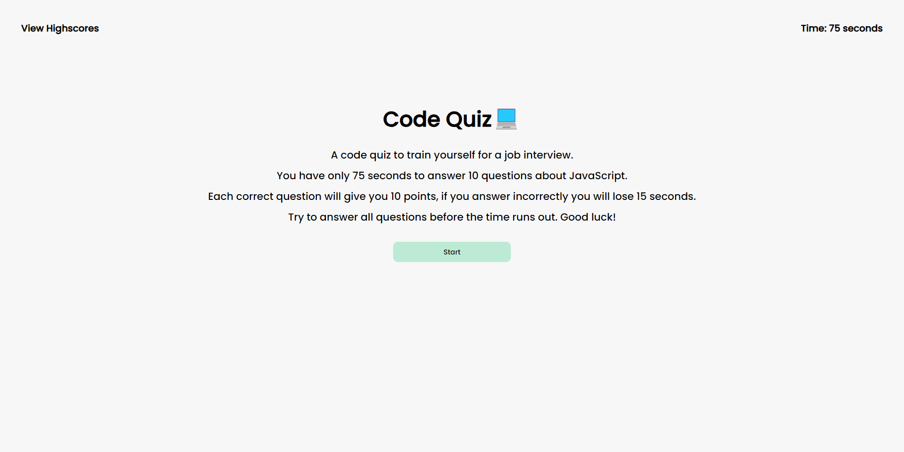
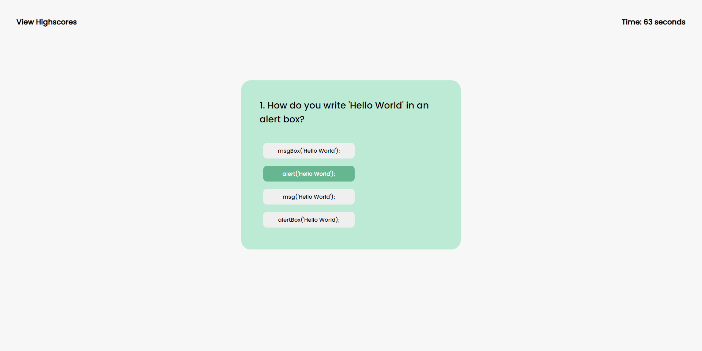

# Code Quiz

## Description
A coding quiz to practice some question related to JavaScript.
You have 75 seconds to answer 10 questions. Each questions answered correctly will give you 10 points. Each wrong answer will take away 15 seconds.

<!-- ## Installation
[Repository](git@github.com:AlinaB108/code-quiz.git)  -->
## Usage
You can find the site here https://alinab108.github.io/code-quiz/

***

***

***
Instructions:
1. Click a button to start the game.
2. Select one of the answers which you think is correct.
3. Add your initials when you finish the game.
4. Submit your initials and check them on Highscore page.
5. Click 'Reset Score' or 'Play Again' button.
6. If you want to check Highscore before the game, click View Highscores link in the top left corner.

## Credits
Used some code for Local storage part from the lesson provided by UT Coding Bootcamp.

Cate Keough helped with part of the code showing questions on the page.

Griffin Gore helped a lot debugging for loop error in my code.

Christopher Banta helped with some advices about the code.

## License 
MIT License

Copyright (c) 2023 AlinaB

Permission is hereby granted, free of charge, to any person obtaining a copy
of this software and associated documentation files (the "Software"), to deal
in the Software without restriction, including without limitation the rights
to use, copy, modify, merge, publish, distribute, sublicense, and/or sell
copies of the Software, and to permit persons to whom the Software is
furnished to do so, subject to the following conditions:

The above copyright notice and this permission notice shall be included in all
copies or substantial portions of the Software.

THE SOFTWARE IS PROVIDED "AS IS", WITHOUT WARRANTY OF ANY KIND, EXPRESS OR
IMPLIED, INCLUDING BUT NOT LIMITED TO THE WARRANTIES OF MERCHANTABILITY,
FITNESS FOR A PARTICULAR PURPOSE AND NONINFRINGEMENT. IN NO EVENT SHALL THE
AUTHORS OR COPYRIGHT HOLDERS BE LIABLE FOR ANY CLAIM, DAMAGES OR OTHER
LIABILITY, WHETHER IN AN ACTION OF CONTRACT, TORT OR OTHERWISE, ARISING FROM,
OUT OF OR IN CONNECTION WITH THE SOFTWARE OR THE USE OR OTHER DEALINGS IN THE
SOFTWARE.